# Assembly - Case

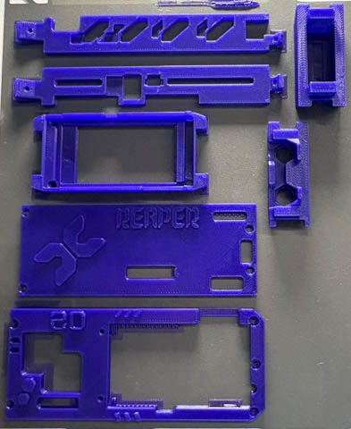{ width="400" }

Once the PCB assembly is complete, the case can be fitted.

## Final Connections

Connect the U.FL-to-SMA cables to the connectors on the E01 and E07 modules.

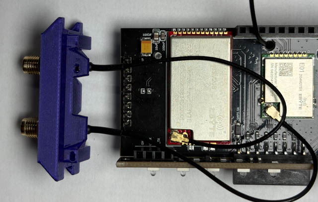{ width="200" }

> **Important:** Take note of which SMA connector is connected to each module. You will need to fit the correct antenna to each connector later in the build.
>
> In this guide, the **centre antenna is the Sub-GHz antenna**, while the two outer antennas are the **2.4 GHz antennas**.

### Fitting the SMA Connectors

Remove the nut and two washers from each SMA connector.

Feed the SMA connectors through the corresponding holes in the top of the case. Secure each connector using the **split washer and nut**.

The additional flat washer is not required.

Slide the top section of the case into the top of the PCB assembly.

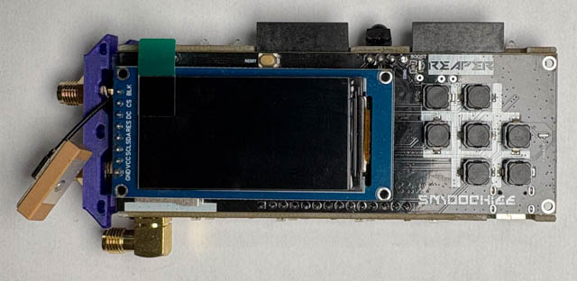{ width="200" }

## Power-On Test

At this point, you can power on the device and perform an initial test.

Check that:

* The screen powers on and displays correctly.
* The buttons are responding correctly.
* There are no obvious signs of a short circuit or other assembly problem.

> **Important:** Do **not** use any feature that transmits using Wi-Fi, the E01, or the E07 modules at this stage. The antennas have not yet been fitted, and transmitting without a suitable antenna connected can damage the RF modules.

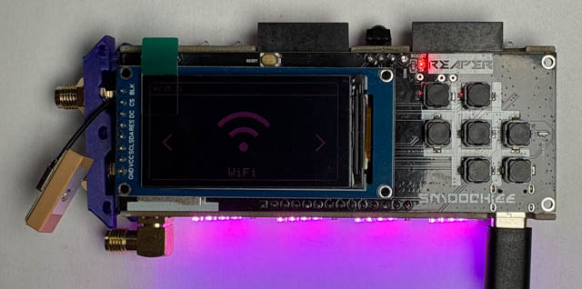{ width="200" }

If you encounter any problems, switch the device off and backtrack through the guide to check the relevant assembly steps.

## Attaching the Case

### Front

To fit the front of the case, carefully lift the edge of the screen assembly and feed the screen through the opening in the front of the case.

You may need to flex the front of the case slightly to allow it to slide fully over the screen. Take care not to apply excessive force to the screen or PCB.

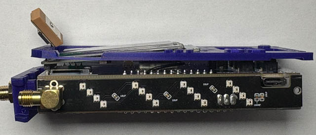{ width="200" }

Once the front of the case is in position, make sure the GPS antenna cable is routed through the cutout in the case.

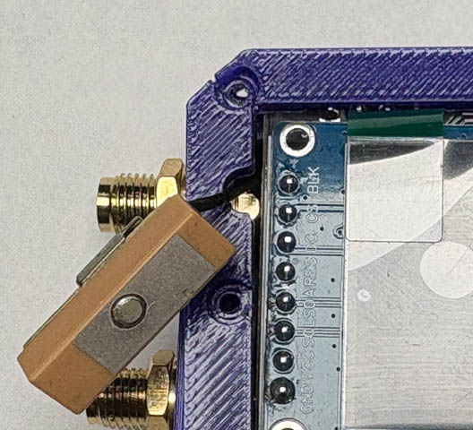{ width="200" }

The screen section of the case fits over the screen and can be secured to the front case using four M2 **8 mm** [socket head cap](ordering.md#socket-head-cap) or [button head](ordering.md#button-head) bolts/self-tapping screws.

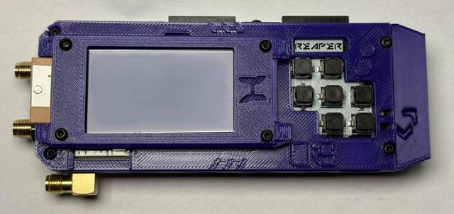{ width="200" }

### Back

Fit the bottom end piece into the PCB assembly first, with the **logo facing towards the front of the device**.

Then fit the back cover over the PCB assembly.

The back cover can be secured using four M2 **4–6 mm** [socket head cap](ordering.md#socket-head-cap) or [button head](ordering.md#button-head) bolts/self-tapping screws.

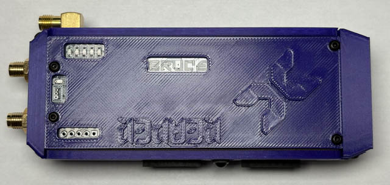{ width="200" }

### Sides

Both side panels are fitted in the same way.

Secure each side panel using two M2 **4–6 mm** [socket head cap](ordering.md#socket-head-cap) or [button head](ordering.md#button-head) bolts/self-tapping screws.

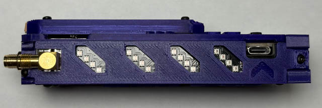{ width="200" }
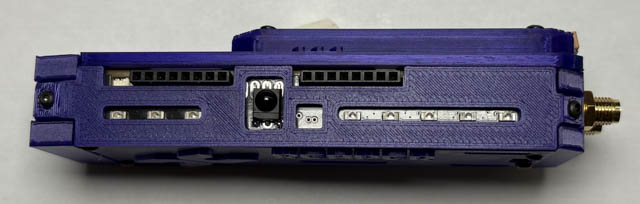{ width="200" }

When fitting the side panels, check that:

* The LED and IR emitter are correctly positioned in their openings.
* No cables are trapped between the case and PCB.
* The case is sitting correctly against the PCB assembly.
* No components are being pressed or forced against the case.

## Final Power-On

The case is now fully assembled.

Power on the device and check that the screen and buttons are still working correctly.

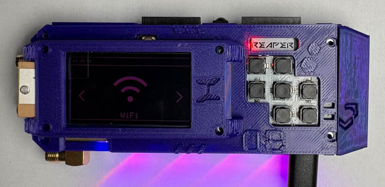{ width="300" }

Your Reaper RF is now assembled and ready for antenna, flashing and testing!

[Next: Flashing and Testing →](flashing-testing.md){ .md-button .md-button--primary }
