# Assembly - Components

## Vibration Motor

The vibration motor is supplied with a protective adhesive backing.

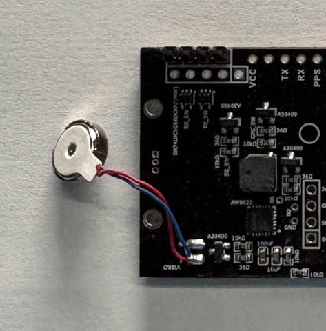{ width="200" }

Remove the protective backing (the white tabbed piece).

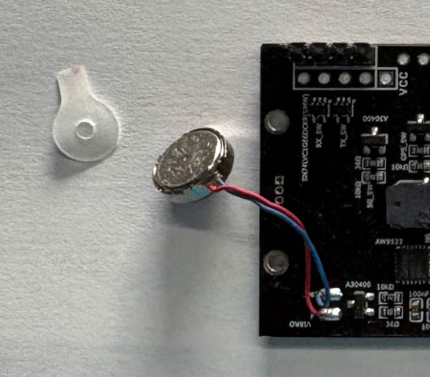{ width="200" }

Stick the vibration motor to the PCB, positioning it centrally on the board next to the three vias (holes) in the PCB.

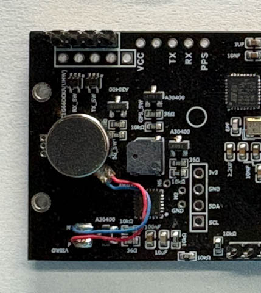{ width="200" }

## IR Emitter

The IR emitter needs to be bent over so that the back of the emitter is flush with the PCB.

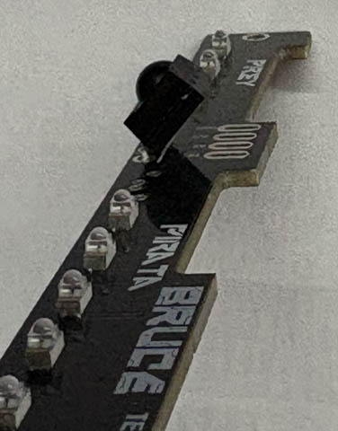{ width="200" }

You may find that the way the IR emitter was originally soldered prevents it from being bent through the full 90°.

If this is the case, carefully desolder the IR emitter and resolder it approximately **2 mm further away from the PCB**. This will give the emitter enough clearance to be bent through 90°.

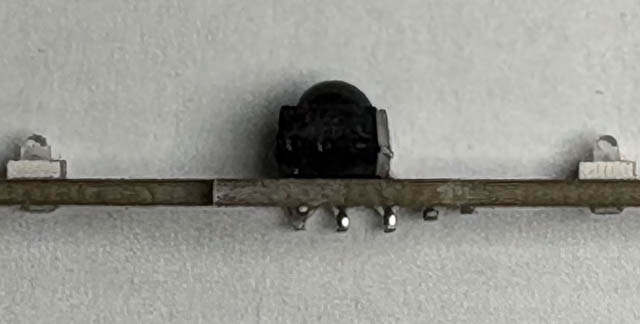{ width="200" }
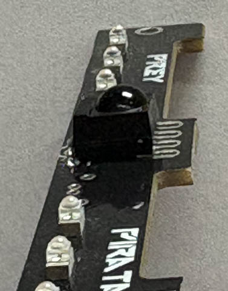{ width="200" }

## U.FL and ESP32

The antenna connects to the ESP32 module using the supplied U.FL cable.

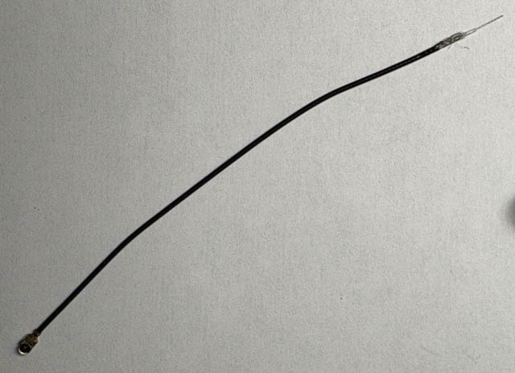{ width="200" }
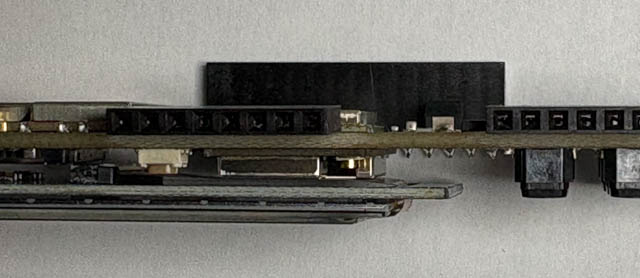{ width="200" }

Connect the U.FL cable to the connector on the ESP32 module.

Route the cable along the side of the ESP32 module and then down through the hole in the PCB. Keep the cable as close to the PCB as possible and route it away from the edge of the screen.

The cable must not protrude beyond the edge of the PCB or interfere with the case when it is assembled.

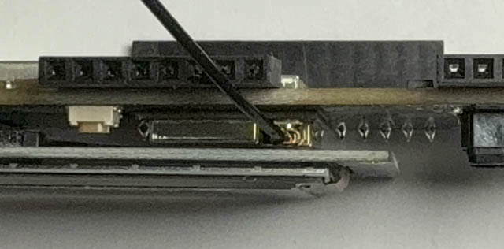{ width="200" }
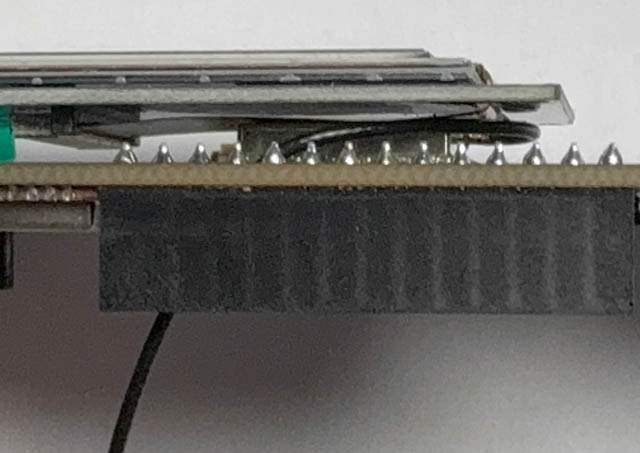{ width="200" }
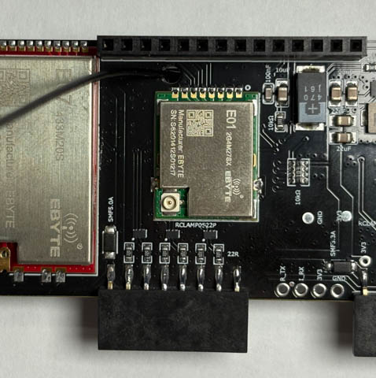{ width="200" }

> **Important:** Make sure the U.FL cable is routed correctly before continuing. Once the case is assembled, access to the cable will be limited.

## GPS Module

The ATGM336H GPS module needs to be soldered to the PCB using the supplied header pins.

> **Important:** When attaching and routing the GPS antenna, make sure that the antenna connector and cable do not touch the supercapacitor (the silver circular component).

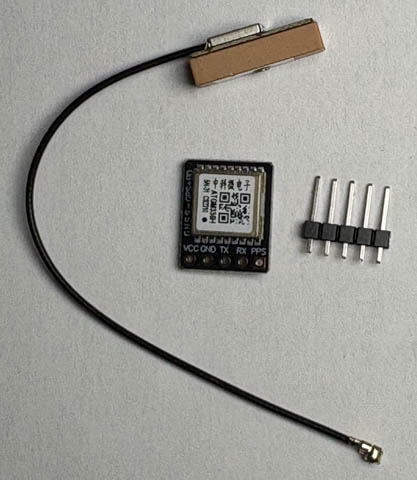{ width="200" }

The header pins should be soldered to the GPS module so that the longer pins extend from the side of the module with the silver RF shield, opposite the antenna connector.

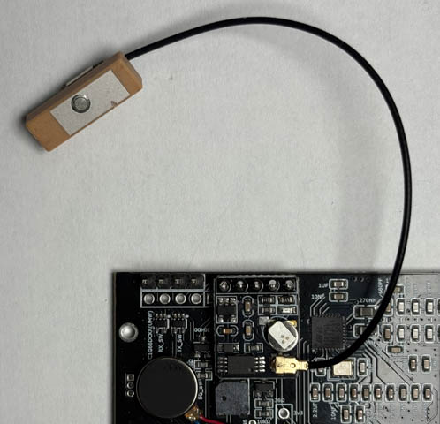{ width="200" }

When soldering the GPS module to the PCB, ensure that the RF shield does not touch any components on the PCB.

The module can be mounted slightly above the PCB if necessary to provide sufficient clearance between the RF shield and the components below it.

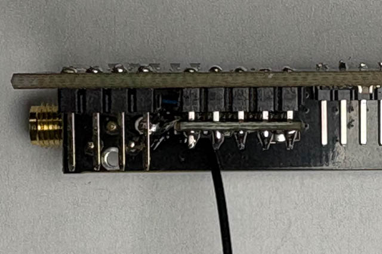{ width="200" }

[Next: Assembly - Sides →](assembly-sides.md){ .md-button .md-button--primary }