# Assembly - Sides

## Attach Sides

The two side PCBs are attached to the front and back PCBs using the **3-pin and 4-pin solder pads**.

The connections can be made by bridging the pads with solder. Adding short pieces of wire can make it easier to create a reliable connection between the boards.

### Using Right-Angle Header Pins

If you have right-angle header pins available, these can be used to help align the side PCBs with the front and back PCBs.

The right-angle header pins can be soldered to the 3-pin or 4-pin pads on the front and back PCBs. The side PCBs can then be positioned against the header pins, using them to help maintain the correct alignment while soldering.

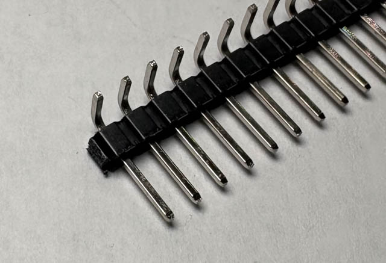{ width="200" }

If using header pins, solder them to the front and back PCBs first.

The protruding legs of the header pins should be cut as close to the PCB as possible after soldering. Alternatively, you can cut the header pins to length before soldering them.

Do the same with any header pins protruding from the side PCBs after they have been soldered.

> **Tip:** Take care when cutting the header pins. Make sure the cut ends do not protrude far enough to interfere with the case or other components.

### IR Emitter Side to Front PCB

First, carefully bend the IR emitter slightly away from the PCB to provide access to the solder pads.

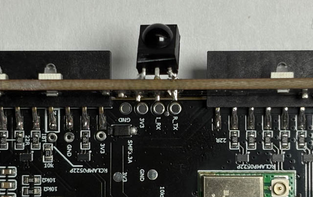{ width="200" }

Align the boards so that the **four-pin pads** on the side PCB line up with the four-pin pads on the front PCB.

If you have right-angle header pins, you can use these to help maintain the correct alignment.

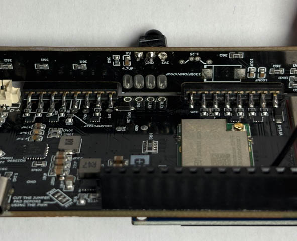{ width="200" }
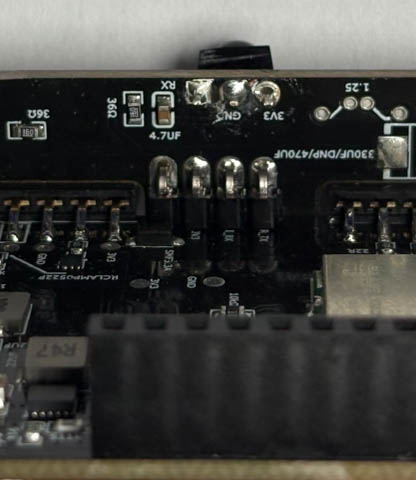{ width="200" }

It can help to solder one of the four pins first. This will hold the boards together while allowing you to adjust their alignment.

Once the first pin is secure, check the alignment and then solder the pin on the opposite side. Once you are happy with the alignment, solder the remaining two pins.

After all four pins have been soldered, check the joint on each pad to ensure that the connection is secure.

Once soldering is complete, carefully bend the IR emitter back so that the rear of the emitter is flush with the PCB.

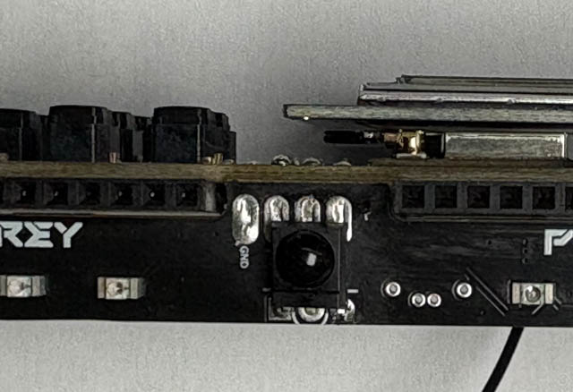{ width="200" }

### LED Side to Back PCB

Attaching the LED side PCB to the back PCB is the same process as attaching the IR side PCB to the front PCB.

Align the boards so that the **three-pin pads** on the side PCB line up with the three-pin pads on the back PCB.

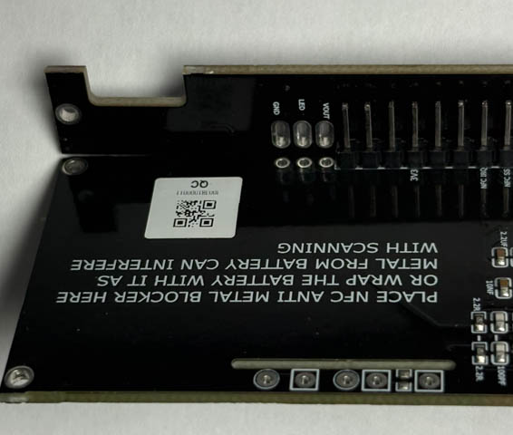{ width="200" }
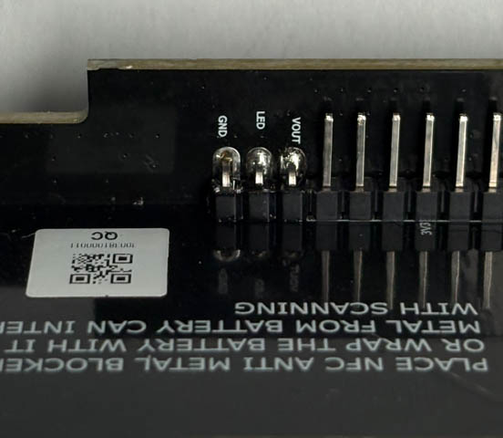{ width="200" }
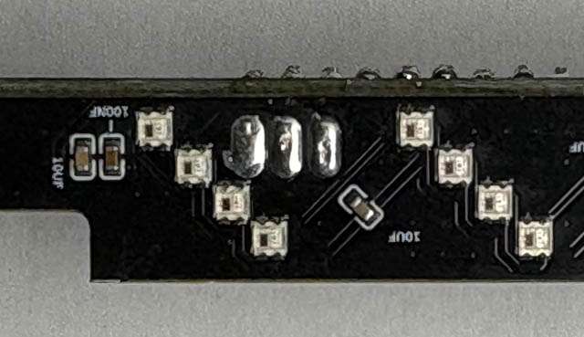{ width="200" }

Once the boards are correctly aligned, solder all three pads together.

## SMA Tail

The SMA tail needs to be soldered to the PCB.

First, carefully strip back the outer black insulation to expose the braided or stranded outer shield. Cut the outer shield back as required, leaving enough exposed to solder to the **rectangular pad** on the PCB.

Next, strip back the inner clear insulation to expose the centre conductor. The centre conductor should be soldered to the **rounded rectangular pad**.

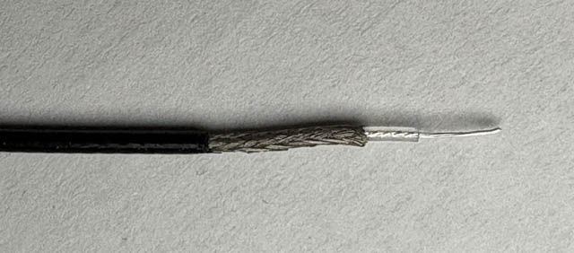{ width="200" }
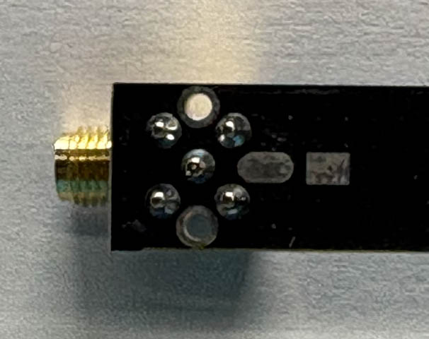{ width="200" }

Take care not to allow any strands from the outer shield to come into contact with the centre conductor.

> **Important:** The centre conductor and outer shield must not be electrically shorted together. Check the connection with a multimeter before powering on the Reaper RF. If the centre conductor is shorted to the shield/ground, inspect the solder joints for solder bridges or stray strands of shield wire and correct them before continuing.

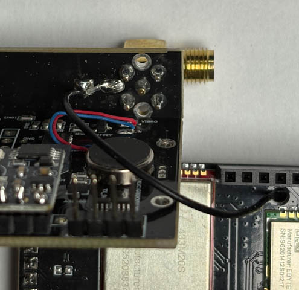{ width="200" }

Once the SMA tail is securely soldered and you have confirmed that there are no shorts between the centre conductor and shield, the PCB assembly is complete.

## Battery

Connect the battery to the **cream/beige JST 1.25 mm connector** on the rear of the front PCB.

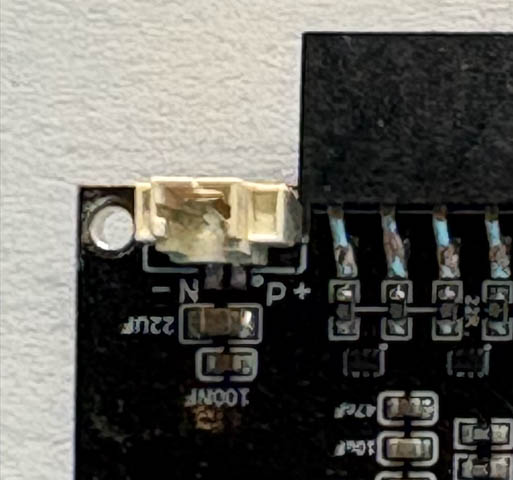{ width="200" }

> **Important:** The battery connector is keyed to prevent it from being inserted the wrong way around. **Do not force the connector into the socket.** If it does not fit easily, remove it and check that it is correctly aligned.

> **⚠️ Very Important - Check Battery Polarity**
>
> Before connecting the battery, carefully check that the wires are connected to the battery connector with the correct polarity.
>
> The polarity markings on the PCB socket are:
>
> * **-N** = Negative
> * **P+** = Positive
>
> The battery wires should be:
>
> * **Black** = **-N (Negative)**
> * **Red** = **P+ (Positive)**
>
> **Do not connect the battery if the polarity does not match.** Connecting the battery with reversed polarity may damage the Reaper RF and/or the battery.
>
> If the wires in the battery connector are reversed, you can swap them around before connecting the battery.
>
> To remove the wires, use a small flat-blade screwdriver to gently lift the locking tab on the battery connector, then carefully pull the wire and terminal out of the connector. Re-insert the wires in the correct positions and make sure they are securely locked in place.
>
> **⚠️ Important:** When working on the battery connector, take care to prevent the two battery wires from touching each other or any metal surface. A short circuit can cause the battery to become damaged and may create a fire or other safety hazard.
>
> **Check the polarity again before connecting the battery to the PCB.**

## Join the Front and Back PCB Assemblies

Before joining the two assemblies, make sure that:

* The battery is connected with the correct polarity.
* The header pins are straight and undamaged.
* The antenna cables are clear and will not be trapped between the PCBs.

Align the front and back PCB assemblies and carefully push the two sets of header pins together.

Take care to ensure that all of the header pins are correctly aligned with their corresponding sockets and that none of the pins become bent during assembly.

> **Important:** Make sure none of the antenna cables are trapped or pinched between the front and back PCB assemblies.

[Next: Assembly - Case →](assembly-case.md){ .md-button .md-button--primary }
