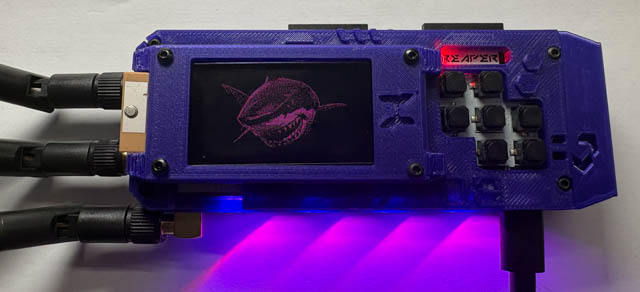
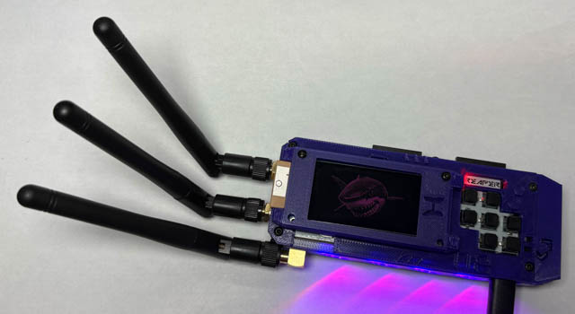

# Flashing and Testing

Your Reaper RF is now fully assembled and ready for the antennas and firmware.

## Install the Antennas

You can now fit the antennas.

> **Final check:** Make sure each antenna is connected to the correct SMA connector. The **centre antenna is the Sub-GHz antenna**, while the **two outer antennas are the 2.4 GHz antennas**.

Double-check the connections before powering on the device.

{ width="400" }

{ width="400" }

## Install the SD Card

The SD card can be installed in the slot on the left underneath the screen.

A **32 GB or smaller** SD card is recommended. For the best reliability, use a reputable manufacturer such as SanDisk.

> **Tip:** If you experience problems with the SD card, try a different card from a reputable manufacturer. Avoid very large-capacity cards.

## Flashing the Firmware

The Reaper RF may already be pre-flashed with Bruce. However, it is recommended that you flash the latest stable version of the firmware to ensure you have the latest features and bug fixes.

1. Go to the [Bruce Flasher](https://bruce.computer/flasher).
2. Select the latest stable version of Bruce.
3. Connect the Reaper RF to your computer using a USB-C cable.
4. While connecting the USB cable, **hold down the centre button** to put the device into flashing mode.
5. If the device has a battery installed, you may need to press the **reset button** above the screen while continuing to hold the centre button.
6. Select **Bruce Boards**.
7. Select **Reaper RF**.
8. Click **Flash** and follow the on-screen instructions.

> **Tip:** If the flasher does not detect the Reaper RF, disconnect the USB cable and repeat the process while holding the centre button. If a battery is installed, try pressing the reset button while holding the centre button.

## Testing the Device

Once the firmware has been flashed, power on the device and perform some basic tests.

### Wi-Fi

Connect the device to your Wi-Fi network and confirm that it can connect successfully.

### IR

Use **TV-B-Gone** to test the IR transmitter.

> **Tip:** Point the IR emitter towards a television and try several commands to confirm that the transmitter is working correctly.

### RF

Use the **Sub-GHz** and **NRF24** features to test the RF modules.

Check that the device can transmit and receive as expected.

> **Important:** Make sure the correct antennas are connected before testing the RF functions.

## Troubleshooting

If you encounter any problems, switch the device off and backtrack through the relevant sections of this guide to check the assembly steps.

Pay particular attention to:

* The antenna connections and antenna positions.
* The UFL cable routing and connections.
* The GPS module and antenna.
* The solder joints connecting the side PCBs.
* The SD card and its installation.
* The firmware version.

If you still have problems, please ask for help in the [Bruce Discord](https://discord.gg/WJ9XF9czVT).
