# Ordering

{ width="600" }

## PCB

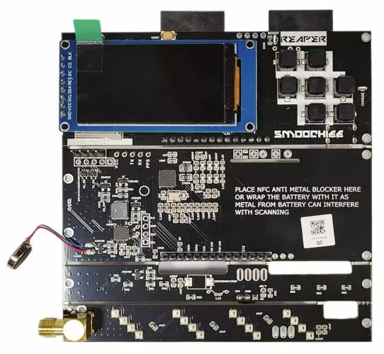{ width="400" }

You can order the (almost) fully assembled Reaper RF from Elecrow [here](https://www.elecrow.com/bruce-pcb-rf-reaper.html){target="_blank" rel="noopener"}.

**Please note:** Some assembly is required, and [additional parts](#additional-parts) will need to be purchased separately. This kit does not include all the components required to complete the build.

## Additional Parts

The following additional parts are required to complete the Reaper RF build. Links to AliExpress searches are provided for convenience, but you may be able to find these parts from other suppliers.

Please check that you are ordering the correct part, as some items may have multiple versions or similar names.

### GPS Module

**ATGM336H**

**Please note:** Make sure the GPS module comes with a rectangular ceramic antenna, the larger square antenna is not compatible with the Reaper RF build without modifications.

[Search AliExpress](https://www.aliexpress.com/w/wholesale-atgm336h-gps-module.html){target="_blank" rel="noopener"}

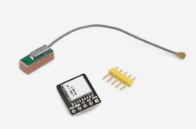{ width="200" }

### Antennas

The Reaper RF build requires three antennas: one for Sub-GHz (433 MHz) and two for 2.4 GHz (Wi-Fi/BLE).

**Please note:** The antennas should have an **SMA male connector** (pin in the middle).

Some listings include a UFL-to-SMA cable. If you purchase one of these, check the cable length carefully, as you don't want one that is too short or too long. A length of **10 cm is recommended**.

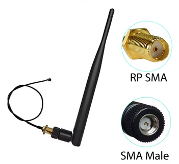{ width="200" }

#### 433 MHz Antenna

[Search AliExpress](https://www.aliexpress.com/w/wholesale-433-mhz-antenna-sma.html){target="_blank" rel="noopener"}

#### 2.4 GHz Antenna

**Please note:** You will need to order **two** of these antennas for the Reaper RF build.

[Search AliExpress](https://www.aliexpress.com/w/wholesale-2.4-ghz-antenna-sma.html){target="_blank" rel="noopener"}

### 2 × UFL-to-SMA Cables

**Please note:** The SMA end of the cable should have a **female connector** (hole in the middle).

A cable length of **10 cm is recommended**.

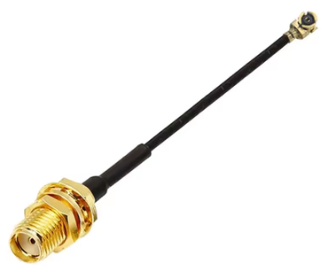{ width="200" }

[Search AliExpress](https://www.aliexpress.com/w/wholesale-sma-to-ufl-cable.html){target="_blank" rel="noopener"}

### UFL Pigtail

These can also be referred to as I-PEX1 cables.

You can also use a UFL-to-SMA cable and cut the SMA end off.

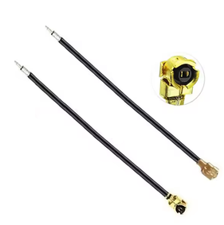{ width="200" }

[Search AliExpress](https://www.aliexpress.com/w/wholesale-ufl-pigtail-open-end.html){target="_blank" rel="noopener"}

### Battery

**102050 LiPo battery with two wires and a JST-PH 1.25 mm pitch plug.**

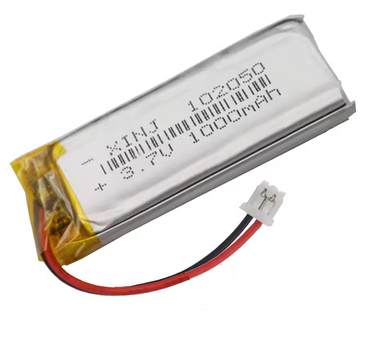{ width="200" }

[Search AliExpress](https://www.aliexpress.com/w/wholesale-102050-battery-1.25.html){target="_blank" rel="noopener"}

> **Note:** If you have difficulty finding a 102050 battery with a 1.25 mm pitch connector, you can purchase a 102050 battery without a connector and a set of wires with a matching 1.25 mm pitch connector.
>
> The connector wires can then be soldered to the battery wires. **Take care to ensure that the polarity is correct** when fitting the connector.
>
> 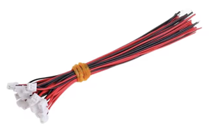{ width="200" }
>
> [Search AliExpress](https://www.aliexpress.com/w/wholesale-jst-1.25-wires.html){target="_blank" rel="noopener"}
>
> **⚠️ Important:** When soldering wires to a LiPo battery, take care to prevent the battery wires from touching each other or any metal object. A short circuit can damage the battery and may create a fire hazard.

### Fasteners

You will need some M2 fasteners to secure the case together. These can be either bolts or self-tapping screws.

4 x M2 × 8 mm (socket head cap or button head) for the front screen part of the case.

12 x M2 × 4-6 mm (socket head cap or button head) for the front, back and sides of the case.

#### Button Head

**Bolts**

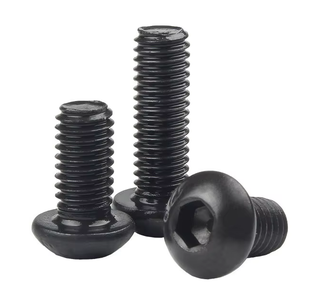{ width="200" }

[Search AliExpress](https://www.aliexpress.com/w/wholesale-m2-button-head-bolts.html){target="_blank" rel="noopener"}

**Self-Tapping Screws**

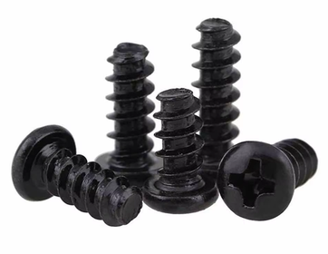{ width="200" }

[Search AliExpress](https://www.aliexpress.com/w/wholesale-m2-button-head-self-tapping-screws.html){target="_blank" rel="noopener"}

#### Socket Head Cap

**Bolts**

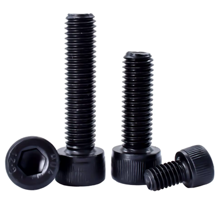{ width="200" }

[Search AliExpress](https://www.aliexpress.com/w/wholesale-m2-socket-head-cap-bolts.html){target="_blank" rel="noopener"}

**Self-Tapping Screws**

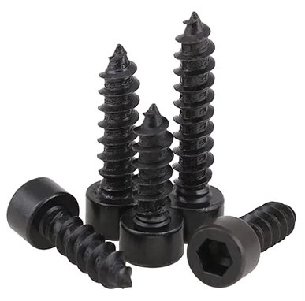{ width="200" }

[Search AliExpress](https://www.aliexpress.com/w/wholesale-m2-socket-head-cap-self-tapping-screws.html){target="_blank" rel="noopener"}

### 3D-Printed Parts

The Reaper RF case consists of several 3D-printed parts. You can download all the STL files as a single ZIP file or download them individually below.

{ width="200" }

[Download All](stls/reaper-rf-case.zip)

**Separate STL files:**

* [Back](stls/reaper-rf-case-back.stl)
* [Front](stls/reaper-rf-case-front.stl)
* [Top](stls/reaper-rf-case-top.stl)
* [Bottom](stls/reaper-rf-case-bottom.stl)
* [Side IR](stls/reaper-rf-case-side-ir.stl)
* [Side LED](stls/reaper-rf-case-side-led.stl)
* [Screen](stls/reaper-rf-case-screen.stl)

[Next: Prepare PCBs →](prepare-pcbs.md){ .md-button .md-button--primary }
