# Prepare PCB

Before beginning assembly, unpack the PCBs and separate the individual boards. Take care when handling the PCBs to avoid damaging components or connectors.

## Unboxing

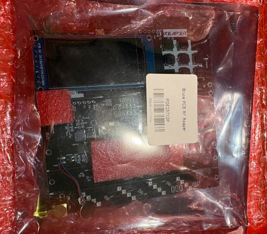{ width="400" }

The Reaper RF PCB is shipped in a box inside an antistatic bag. The PCBs should also be protected by a layer of bubble wrap inside the box.

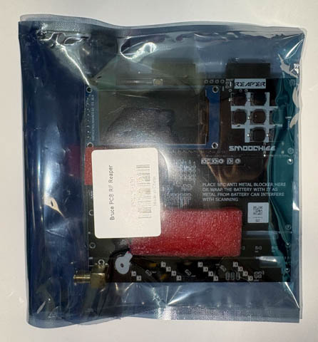{ width="200" }

You may find that some of the PCBs have become separated from each other during shipping. This is normal and should not cause any problems.

## PCB Overview

The Reaper RF is made up of **four PCBs**:

* One front PCB
* One back PCB
* Two side PCBs

The PCBs are supplied as a single panel, with the four boards connected together using small perforated sections known as **mouse bites**.

The Reaper RF has components on both sides of the front and back PCBs. The two side PCBs are fitted between the front and back PCBs and are connected using the supplied header pins.

### Remove Foam Padding

The two sets of male header pins are supplied with foam padding to protect the pins during shipping.

Remove the foam padding from both sets of header pins before proceeding.

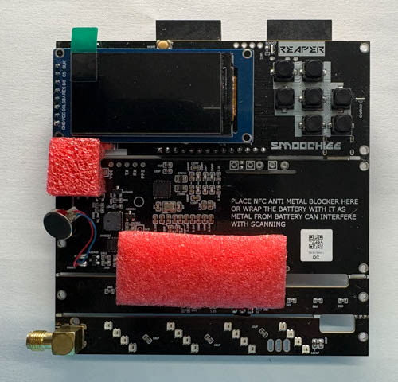{ width="200" }
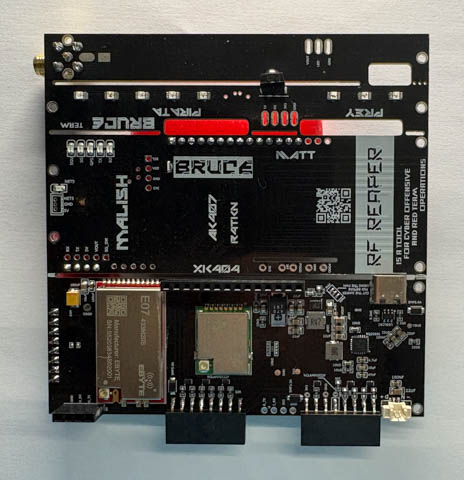{ width="200" }

### Separate the PCBs

The four PCBs are connected using small perforated sections called **mouse bites**. These are designed to make it easy to separate the individual PCBs.

You can separate the PCBs by carefully bending them over the edge of a table or workbench. Alternatively, you can use a pair of pliers to gently snap the boards apart.

> **Take care when separating the PCBs.** Avoid bending the boards excessively or applying force to components, tracks, or connectors.

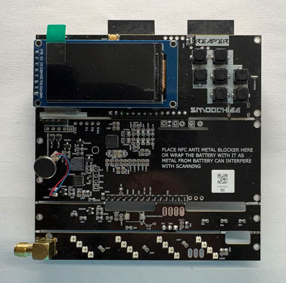{ width="200" }
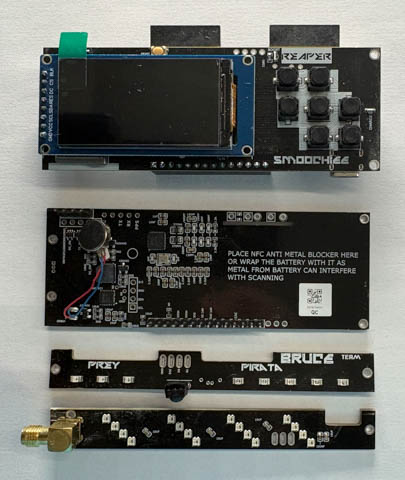{ width="200" }

Once separated, you should have four individual PCBs:

* **Front PCB** - the larger front board
* **Back PCB** - the larger rear board
* **Side PCB × 2** - the smaller boards that connect to front and back PCBs

The side PCBs will be fitted to the front and back PCBs later in the assembly process.

### Clean Up the Edges

After separating the PCBs, you may find small pieces of PCB material remaining where the mouse bites were attached.

Carefully remove any remaining material using a pair of pliers, side cutters, or a small file. Smooth any rough edges before continuing with the build.

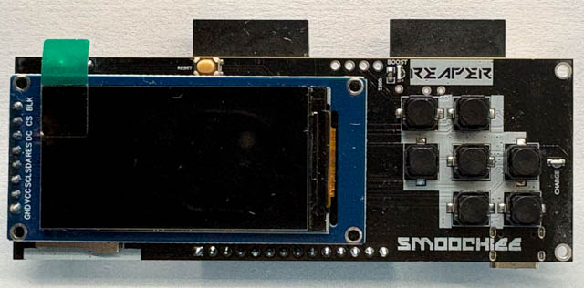{ width="200" }
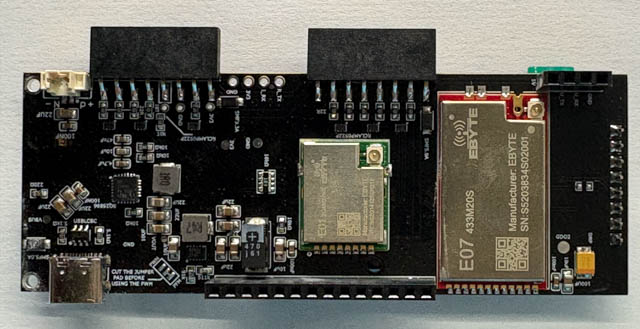{ width="200" }

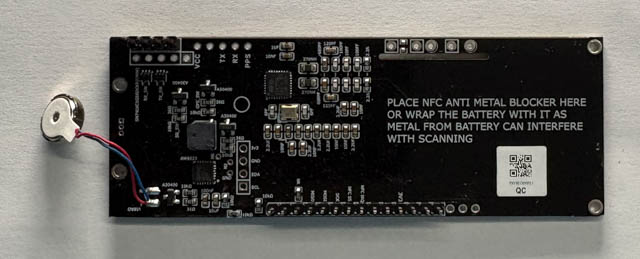{ width="200" }
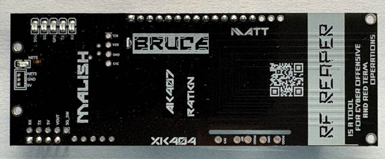{ width="200" }

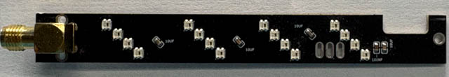{ width="200" }
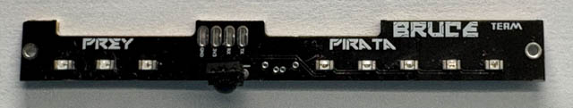{ width="200" }

You should now have four clean, separate PCBs ready for assembly.

[Next: Assembly - Components →](assembly-components.md){ .md-button .md-button--primary }
