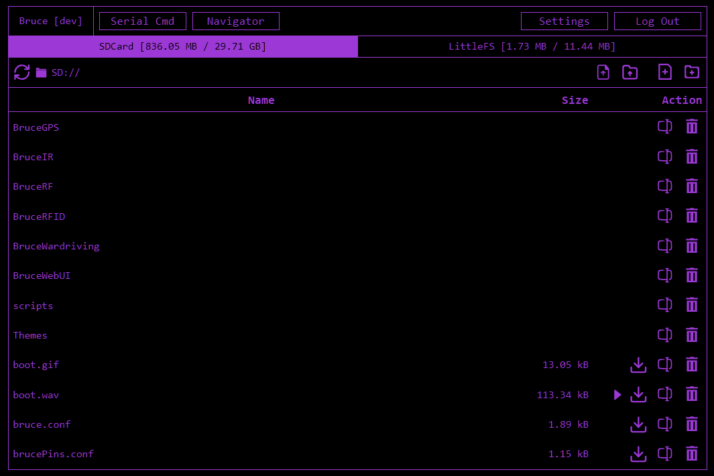
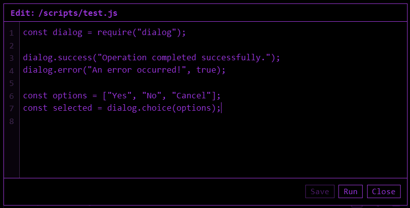
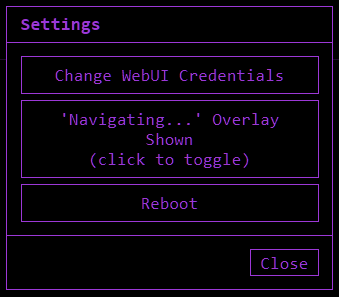

# WebUI

## Start WebUI

To use the WebUI you first need to start it.

 * On the main menu goto Files -> WebUI
 * Choose either
    * My Network - uses the current WiFi network or prompt to connect to one
    * AP Mode - the device creates its own WiFi network than you can connect to

Once you have connected your device to your WiFi or connected to the devices AP you can connect to the WebUI.

## Features

* View the devices screen using the [Navigator](#navigator)
* Manage files/folders on the LittleFS partition and SD card if available
    * Top bar buttons
        * :material-file-upload-outline: Upload file
        * :material-folder-upload-outline: Upload folder
        * :octicons-file-added-24: Add file
        * :material-folder-plus-outline: Add folder
    * File/folder action buttons
        * :material-play: Run file on device
        * :octicons-download-16: Download file
        * :material-form-textbox: Rename file/folder
        * :material-trash-can-outline: Delete file/folder
* Edit text based files using the [Editor](#editor)
* Run certian files like .ir/.sub/.js on the device
* Execute serial commands
 
To access type the hostname `http://bruce.local` or the IP address displayed on screen into your web browser.

### Navigator

To access the Navigator click the `Navigator` button at the top of the WebUI.

The buttons on the right can be used to control the device.

| Action | Icon |
| - | - |
| Navigation | :octicons-triangle-up-24: :octicons-triangle-down-24: :octicons-triangle-left-24: :octicons-triangle-right-24: |
| Enter/Select | :fontawesome-solid-circle: |
| Long Press | :material-circle-double: |
| Back/Escape | :octicons-undo-24: |
| Previous/Next | :material-arrow-collapse-down: :material-arrow-collapse-up: |

#### Navigating with Keyboard

You can use your PC keyboard for navigating instead of the on-screen buttons.

| Action | Keys |
| - | - |
| Navigating | Arrow Keys |
| Back | Backspace |
| OK | Enter |
| Long Press | M |
| Page Up | Page Up |
| Page Down | Page Down |
| Close Navigator | Escape |
| Reload Screen | R |

### Editor

Clicking on text based file will load the editor.

#### Keyboard Shortcuts

Once in the editor you can use a lot of the common text editing shortcuts available in apps like Visual Studio Code.

* **CTRL+S**  Saves the file
* **ALT+ENTER**  Runs the file on the device
* **CTRL+/**  Adds/removes comments for the selected line(s)
* **TAB/SHIFT+TAB**  Increases/decreases intending

### Settings

* **Change WebUI Credentials** - set the username and password to login to the WebUI
* **Navigating Overlay** - toggles the 'Navigating...' text over the Navigator when the screen is being updated
* **Reboot** - reboots the device

## Automatically Starting WebUI

You can start the WebUI every time the device boots.

* Activate WiFi at startup
   * Goto Config -> Startup WiFi -> Enable
* Set WebUI as startup app
   * Goto Config -> Startup App -> WebUI