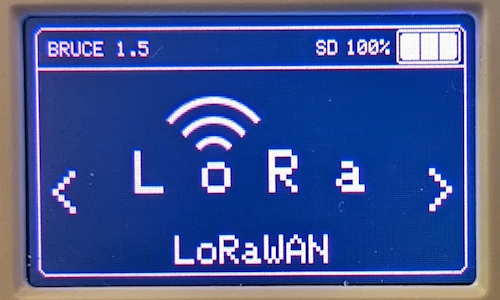
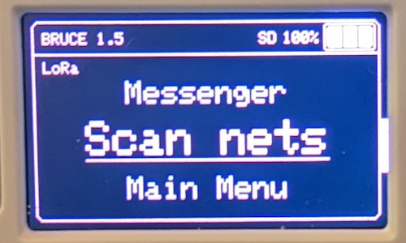
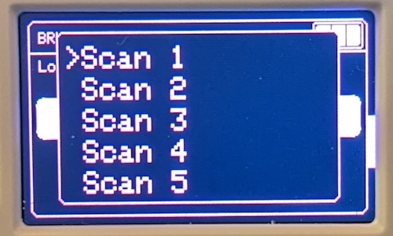

# Help with Bruce Development

## Prerequisites

First you need to clone the repository and build Bruce from sources.

You will find the documentation here:

1. [optional] but recommended: Work from a [Python virtualenv](https://github.com/pyenv/pyenv-virtualenv)
    * This is not required if using VSCode and PlatformIO
2. [Build Firmware](building-from-source.md)
3. [Install Firmware](../how-to-install.md#manual-flashing)


## Add Support for More Devices

More information [here](porting-to-devices.md).


## Bruce Structure

Main code in `src/core` and modules in `src/modules`.

In `module` repository, we have one folder for each category. Don't hesitate to ask on the Bruce Discord where to add files for your module.


### Example

If we want to create a LoRa menu and module we create a new directory and new files:

```
.
└── src/
    ├── core/
    │   └── menu_items/
    │       ├── LoRaMenu.h
    │       └── LoRaMenu.cpp
    └── modules/
        └── lora/
            ├── lora.h
            └── lora.cpp
...
```


## Dependencies

If you need to install a new library, you have two choices:

1. Use `pio` package manager
2. `lib_deps` in `platformio.ini`
3. Add your custom library in `lib/`


### PIO Package Manager

To install install librairies you can search or install them:

```bash
pio pkg search mylib
pio pkg install -l mylib
```

!!! warning

    Do not commit the `platform.io` auto generated file. Instead add your lib in the adequate section of the file. Or ask on the Discord where to write it.


### Custom Libraries

Put your library in `lib/mylib'. Then you can import it with:

```C
#include "../lib/mylib/mylib.h"
```


## Development Example

As an example, we will see how to add a LoRa module in Bruce. This is a 868 MHz RF module with dedicated protocol. But we are not interested in how LoRa works, it's just for an example.

You can either add to an existing existing menu, or create a new item in the main menu.


### Add New Main Menu Item

Register item by creating 2 files:

* `src/core/menu_items/LoRaMenu.h`
* `src/core/menu_items/LoRaMenu.cpp`

In `LoRaMenu.h, we declare the menu object with the mandatory methods:

* `optionsMenu()` --> declare the menu options
* `drawIcon()` --> draw the icon

It looks like this:

```C
#ifndef __LORA_MENU_H__
#define __LORA_MENU_H__
#include <MenuItemInterface.h>

class LoRaMenu : public MenuItemInterface {
public:
    LoRaMenu() : MenuItemInterface("LoRa") {}

    void optionsMenu(void);
    void drawIcon(float scale);
    bool hasTheme() { return bruceConfig.theme.lora; }
    String themePath() { return bruceConfig.theme.paths.lora; }

private:
    void configMenu(void);
};

#endif
```

In `LoRaMenu.cpp` declare the methods needed. Their contents will be explained later in this example.

```C
#include "LoRaMenu.h"
#include "core/display.h"
#include "modules/lora/lora.h"

void LoRaMenu::optionsMenu() {
    // We will use this later

    delay(200);
    loopOptions(options,false,true,"LoRa");
}

void LoRaMenu::drawIcon() {
    // We will use this later
}
```

We're done for the register part. Now, we need to develop the content of the 2 methods previously declared:

1. `LoRaMenu::optionsMenu()` --> the declaration of the menu when the main item is selected
2. `LoRaMenu::drawIcon()` --> the icon that will be draw on screen


#### Draw Icon



**drawIcon()**
With this function, you can draw your own icon. To be able to draw, you can use the following functions:

| Function | Description |
| ------------ | --------------- |
| `tft.drawLine()` | Draw a simple line |
| `tft.drawRect()` | Draw a rectangle |
| `tft.drawRoundRect()` | Draw a rounded border rectangle |
| `tft.drawCentreString()` | Display a screen center on coordinates |
| `tft.drawCircle()` | Draw a circle |
| `tft.drawArc()` | Draw an arc |
| `tft.fillRect()` | Draw and fill a rectangle |
| `tft.fillRoundRect()` | Draw and fill a rounded border rectangle |
| `tft.fillCircle()` | Draw and fill a circle |
| `tft.fillScreen()` | Fill the whole screen |

Here is an example of the definition in `src/core/menu_items/LoRaMenu.cpp`:

```C
void LoRaMenu::drawIcon() {
  clearIconArea();

  tft.drawArc(19+iconX,45+iconY,12,10,130,230,FGCOLOR,BGCOLOR);
  tft.drawArc(19+iconX,45+iconY,22,20,130,230,FGCOLOR,BGCOLOR);
  tft.drawArc(19+iconX,45+iconY,32,30,130,230,FGCOLOR,BGCOLOR);
  tft.drawCentreString("L o R a",40+iconX, 40+iconY, SMOOTH_FONT);
}
```


#### Options Menu



##### LoRaMenu::optionsMenu()

We need to declare the options, like we started in `src/core/menu_items/LoRaMenu.cpp`. For this we use the `loopOptions()` function.

This function takes as an argument an `options` object. In parameter, the `*_run` are functions called when the option will be selected by the user. For now, those functions do not exist.

Here is an example:

```C
void LoRaMenu::optionsMenu() {
  options = {
    {"LoRa Gw",         [=]() { lora_gw_run(); }},
    {"Messenger",       [=]() { lora_msg_run(); }},
    {"Scan nets",       [=]() { lora_scan_run(); }},
    {"Main Menu",       [=]() { backToMenu(); }}
  };
  delay(200);
  loopOptions(options,false,true,"LoRa");
}
```

##### Return to the main menu

Use the `backToMenu()` call. It's only switching a global boolean: `returnToMenu`. This way you can implement a main menu return like this:

```C
if (!returnToMenu) {
  // Run you stuff
}

// Will return to main menu after you last call
```


### Add or Modify Sub-Menus



You may want to draw a sub-menu, for example if you want to scan the nework ids, the user selects the desired option, then a sub-menu appears with the found results. For this you can do the exact same thing as a simple menu, it will automatically detect you'are in a sub-menu. Moreover, you can dynamically generate your sub-menu options like this.

This is a module specific feature, so the declaration will be in `src/modules/lora/lora.h`:

```C
void lora_scan_run();
```

Here is an example of a dumb scan with dynamic options, in `src/modules/lora.cpp`:

```C
void lora_scan_run() {
  char number[1];

  // Display a banner while scanning runs in the background
  displayRedStripe("Scanning..", TFT_WHITE, FGCOLOR);
  delay(2000);

  options = { };
  for(int i=1; i<10; i++) {
    sprintf(number, "Scan %d", i);
    options.push_back({number,    [=]()  { /*do_things(i);*/ }});
  }
  options.push_back({"Main menu", [=]() { backToMenu(); }});

  delay(200);
  loopOptions(options);
  delay(200);
}
```


### Module Functions

You can now start to code the main functions of your module. Here we already made a call for `lora_gw_run()` and `lora_msg_run()`. Start to declare them in `src/modules/lora/lora.h`:

```C
void lora_scan_run();
void lora_gw_run();
void lora_msg_run();
```

Then code the functions in `src/modules/lora/lora.cpp`:

```C
#include "lora.h"

// Important imports to play with buttons, keyboard, screen etc.
#include "core/globals.h"
#include "core/display.h"
#include "core/mykeyboard.h"

void lora_gw_run() {
  // Do some stuff
}

void lora_msg_run() {
  // Do some stuff
}
```
