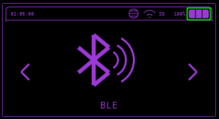
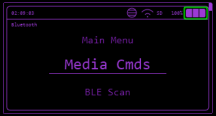

---
tags:
 -  _TODO
todo: Formatting
      Go through each menu item and add documentation
---
# BLE

Features relating to BLE.

## Disconnect BLE

If BLE is currently active, use this option to disconnect. No further explanation needed.

## Media Commands

Control your smartphone’s media functions(works with mostly all Android devices):

* Take screenshots
* Play/pause music
* Stop playback, and more!

## BLE Scan

Scan for nearby Bluetooth Low Energy (BLE) devices effortlessly.

## BadBLE

Simulate a keyboard to deploy DuckyScripts to paired devices.

### Note

* The device **must be previously paired** for this feature to work.
* After disconnecting BLE, you need to restart the device to enable this functionality again.

## BLE Spam Features

### iOS Spams

Sends bluetooth device pairing following AppleJuice and SourApple packet samples

* **[AppleJuice](https://github.com/ECTO-1A/AppleJuice):** iOS Bluetooth pairing spam.
* **[SourApple](https://github.com/RapierXbox/ESP32-Sour-Apple):** iOS Bluetooth crash exploit.

### SwiftPair Spamming

Send Bluetooth device pairing notifications for Windows (SwiftPair)

### Android Spam

Bluetooth pairing notification spamming for Android devices *(added in version 1.0.0)*.

### Samsung Devices

Bluetooth notification spamming for Samsung devices *(added in version 1.0.0)*.

### Spam All

A universal option to spam all supported devices simultaneously, it is more effective in controlled environments)

## iBeacon

Simulate an Apple [iBeacon/Airtag](https://en.m.wikipedia.org/wiki/IBeacon). It can be tracked with an app like [Beacon Locator](https://f-droid.org/en/packages/com.samebits.beacon.locator/), which also provides an estimation of the distance.
