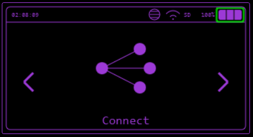

# Connect

Communication between Bruce devices over WiFi.

## Send/Receive File

You can send/receive files between two Bruce devices over WiFi.

Put one device into `Receive` mode, then on the other send a file.

## Send/Receive Command

You can send/receive serial commands between two Bruce devices over WiFi.

Put one device into `Receive` mode, then on the other send a command, more information on serial commands [here](../controlling-device/serial.md).
