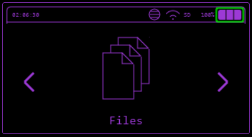
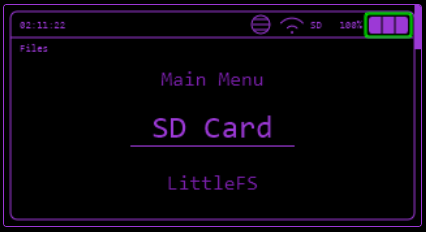

# Files

Files, WebUI and Mass Storage functions.

## SD

Create Folders or Rename, Copy (to LittleFS also) and Delete files.

## LittleFS

Delete, Copy, Rename or Read files from LittleFS.

## WebUI

The WebUI gives you the ability to manage your files/folders, view the device screen, run serial commands and execute payloads like IR, RF and BadUSB.

More detailed documentation about the WebUI can be found [here](../controlling-device/webui.md).

## Mass Storage

You can emulate a USB storage device and access the files of SD Card or LittleFS via USB.
