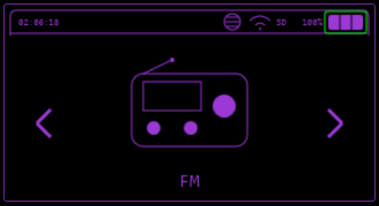
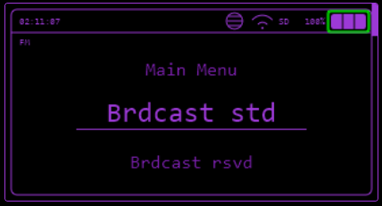
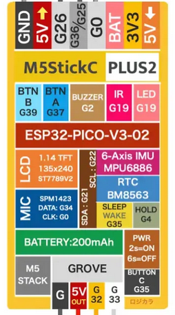
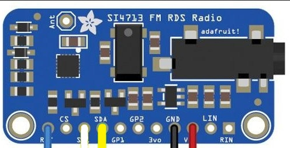

---
tags:
 -  _TODO
todo: Check 'work in progress' sections
      Test with module and check documentation matches real world
---
# FM

Transmit audio on `76-108 MHz` frequencies with a Si4713 module.

## Supported Modules

It needs to a Si4713. Those modules are supported and known to work:

1. [Adafruit Si4713](https://www.adafruit.com/product/1958)
2. [CJMCU-4713](https://s.click.aliexpress.com/e/_DCKYlfz)

## Audio Input

Currently, the audio is transmitted via the P3 cable (3.5mm jack), it is necessary for an external device connected to the P3 cable to send the audio to the FM Transmitter.

An example would be using a phone with a P3 - P3 cable, connected to the transmitter and playing some music on the phone.

## Wiring

### Schematic

### Pins

| Si4713 | M5StickC | Cardputer |
| --------- | ----------- | ------------------- |
| RST | ATTENTION | ATTENTION |
| SCL | Grove G33 | Grove G1 |
| SDA | Grove G32 | Grove G2 |
| GND | Grove G | Grove G |
| VIN | Grove 5V | Grove 5V |

> ATTENTION: It is necessary to turn on the device (StickC/Cardputer), place 1 wire on the RST pin of the FM Transmitter and quickly touch the end of the wire to GND to activate the RST, this way it is not necessary to use the SD Card Sniffer or the G0 pin of StickC.
>
> It is also possible to place a button or resistor for this operation, if you prefer.

[Example Video](https://www.veed.io/view/d70db376-0591-487c-88f9-bab03479010f?panel=share)

## Features

### Broadcast Standard

Broadcast sound from the Si4713 to the selected frequency.

* Select first the tens: `80`, `90` or `100` MHz.
* Then you choose the unit: `81`, `82`, `83`, `84` MHz etc.
* Finally the radio frequency: `81.1`, `81.2`, `81.3` MHz etc.

When broadcast is started, you can leave FM radio menu and run something else. FM broadcast will run in the background.

Auto mode available.

### Broadcast Reserved

> **Warning**: this could be illegal depending on your country. Educationnal purpose only.

Works the same way as [Broadcast Standard](#broadcast-standard) but on reserved frequencies, which are 76 - 87.5 MHz.

Auto mode available.

### Broadcast Stop

Stop broadcasting.

### FM Spectrum

*Work in progress*.

Display noise spectrum on a given frequency.

Auto mode available.

### Hijack TA

> **Warning**: this could be illegal depending on your country. Educationnal purpose only.

*Work in progress*.

Hijack a traffic announcement radio station to automatically start and set frequency of the cars around the transmitter.
Broadcast is working and TA flag is set, but auto start and switch of car radios does not work for now.

Radio frequency is set to info traffic station which is `107.7 MHz`.

## Auto Mode

In this mode, the Si4713 will listen for all frequency and select the one with minimum noise level, which represents a free radio station.
