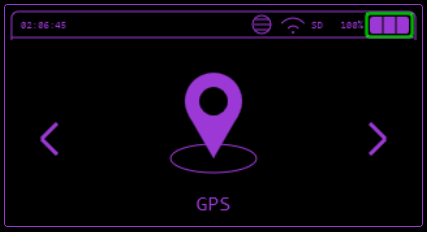
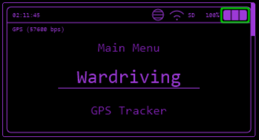

# GPS

Features to work with a connected GPS module.

## Wardriving

You can Wardrive using Bruce if you have a GPS module connected to your device.It iwll create a .csv that can be uploaded to WiGLE!

[WiGLE](https://wigle.net/) (Wireless Geographic Logging Engine) is an online platform that collects and maps Wi-Fi and cellular network data globally. Users can upload network data they encounter, view coverage maps, and search for specific networks.

### How to Use WiGLE

1. **Network Mapping:** Find and map Wi-Fi networks in specific areas, useful for wardriving or security studies.
2. **Coverage Analysis:** Check Wi-Fi coverage in public or commercial locations.
3. **Security:** Identify insecure or misconfigured networks.
4. **Research:** Used by researchers to analyze network patterns and security.

#### How to Begin

1. Create an Account: [WiGLE.net](https://wigle.net/)
2. Join the Group "Bruce": Search for Bruce and select "Join". [Group Stats](https://wigle.net/stats#groupstats)

#### How to upload

##### Via Bruce Device

1. Go to the website [WiGLE Account](https://wigle.net/account), select the API Token option and copy the entire token from "Encoded for use". (Be careful, this token should not be shared with anyone)
2. Insert the token copied from your WiGLE account into the "wigleBasicToken" line of the "bruce.conf" file at the root of your SD card
3. Select menu Others > SD Card > BruceWardriving > timestamp_wardriving.csv
4. Select the "WiGLE Upload" option.
5. Select your WiFi network
6. Wait for the file to be sent. A loading bar should appear with information at the end saying that the file has been uploaded
7. Shark, you have already collaborated, whenever you find new WiFi networks in wardriving, just upload the file

#### Via WiGLE Website

1. Get the `.csv` file off your device from the `BruceWardriving` folder.
2. Goto [WiGLE Uploads](https://wigle.net/uploads) and upload the `.csv` file. WiGLE.net may take a few hours to process the file is the queue is long

### Tip

On the "Statistics: Manufacturer > SSID/Manufacturer" page ([SSID Stats](https://wigle.net/stats#ssidstats)), you can find a list of the most used Wi-Fi network names globally, which can inspire ideas for Bruce's Evil Portal ([Evil Portal](wifi.md#evil-portal)).

## GPS Tracker

This function will log the GPS coordinates of your device whenever they change. You can use the generated `.csv` files to extract and plot these coordinates using mapping websites/software.
