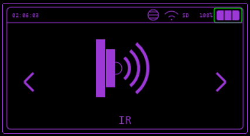
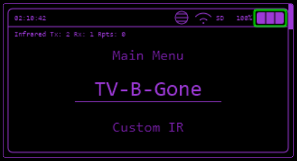

---
tags:
 -  _TODO
todo: Properly document each menu feature
---
# IR

Various Infrared functions including TV-B-Gone, sending and receiving IR commands.

## Supported Modules

### Built-In Options

* **Infrared Emitter** Most devices come equipped with a built-in IR emitter.
* **[M5Stack Mini Infrared Emitter & Receiver Unit](https://shop.M5Stack.com/products/ir-unit)** This module offers easier connectivity compared to other options.

### Unofficial Modules

* **[KY-005](https://arduinomodules.info/ky-005-infrared-transmitter-sensor-module/)**: Infrared Transmitter
* **[KY-022](https://arduinomodules.info/ky-022-infrared-receiver-module/)**: Infrared Receiver
  *Note: These modules may be available under different names and may require modifications for optimal range when used with 3.3V boards. See [source 1](https://www.reddit.com/r/AskElectronics/comments/183mhh6/increase_voltage_power_for_ir_led_powered_by_33v/) and [source 2](https://circuitdigest.com/forums/internet-things/how-interface-hx-53-ir-transmitter-infrared-sensor-module-esp32) for details.*

* **[Elecrow Arduino Infrared Remote Control IOT Smart IR Module](https://www.elecrow.com/arduino-infrared-remote-control-iot-smart-ir-module.html)**: Functions well at 3.3V without requiring modifications.
* **IR Hats for Raspberry Pi**: Designed for 3.3V operation; untested but expected to work.
* **[LOLIN D1 IR Shield](https://www.wemos.cc/en/latest/d1_mini_shield/ir.html)**: Requires soldering for setup.
* **[DIY Board](https://tasmota.github.io/docs/IR-Remote/#related-projects)**: Additional option for custom projects.

### Default Pinouts

* **TX**: Built-in LED
* **RX**: GROVE_SCL

### Request for Information

* **Wanted**: Comparative analysis of the range performance of different IR modules.

## Unsupported/Non-Functional Modules

* **YT-IRTM Transmitter/Receiver**: Utilizes a serial connection and supports NEC protocol only.
* **[Flirc](https://flirc.tv/)**: Other unbranded IR receivers and blasters with USB/USB-C connections, such as [this product](https://www.walmart.com/ip/Universal-Remote-Smartphone-IR-Controller-Adapter-USB-C-Infrared-Blaster-Control-for-Android-Phone-All-in-One-Air-Conditioner-TV-DVD-STB-Black/5426981611?selectedSellerId=101177603).

## Features

* :white_check_mark: **TV-B-Gone**: Sends infrared signals to turn off various screens.
* :white_check_mark: **Custom IR**: Allows sending of custom IR codes from files stored in LittleFS or on an SD card.
* :white_check_mark: **IR Read**: Capable of reading and decoding incoming IR signals.

## Replay Payloads Like Flipper

To access `.ir` files, visit: [Infrared Payloads](https://github.com/BruceDevices/firmware/tree/main/sd_files/infrared).

[Lucaslhm/Flipper-IRDB](https://github.com/Lucaslhm/Flipper-IRDB) also has so many payloads you can use

### Methods for Transmitting `.ir` Files

1. **Custom IR App** Select commands individually from the **IR** menu
2. **SDCard/LittleFS File Manager** Access under the **Files** menu (sends all commands)
3. **[WebUI](../controlling-device/webui.md#features)** by clicking the :material-play: icon (sends all commands)
4. **Serial Command** For example, use `ir tx_from_file AC_LG_SX122CL_off.ir` for further details, refer to the [Serial Command Guide](../controlling-device/serial.md) (sends all commands)
