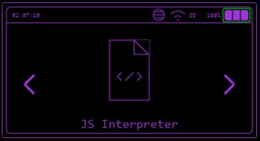
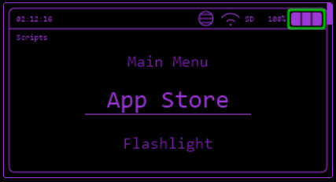

# JS Interpreter

The Bruce JS Interpreter allows you to create apps or games using JavaScript.

## Example Scripts

Some [example scripts are here](https://github.com/BruceDevices/firmware/tree/main/sd_files/interpreter).

## Uploading Your Scripts to Device

You can copy your favourite scripts in the `/scripts` folder and have them listed in the `Scripts` menu.

Use the [WebUI](../controlling-device/webui.md).

When uploading scripts to Bruce, keep in mind:

* **Only JavaScript (`.js`) files can be uploaded.**
* If you have **TypeScript (`.ts`)** files, you must first [**compile it to JavaScript** (`.js`)](../interpreter/typescript.md).

## Creating Scripts

More documentation on the JS Interpreter can be found [here](../interpreter/index.md)
