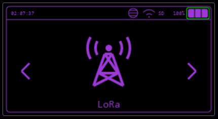
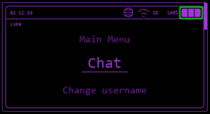

---
tags:
  - _TODO
todo: Properly document each menu feature
---
# LoRa

Simple chat function between Bruce LoRa enabled devices.

> This feature does require a LoRa module to be connected to your device.
>
> You can only communicate with other Bruce devices and not other LoRa communication implementations like Meshtastic and Meshcore.

## Supported Modules

* SX1276
* SX1262
