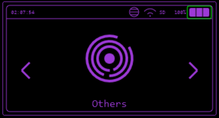
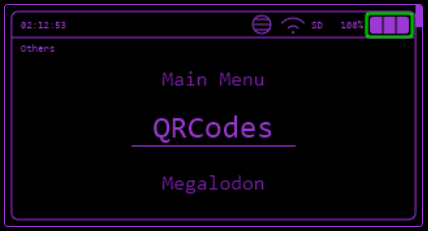
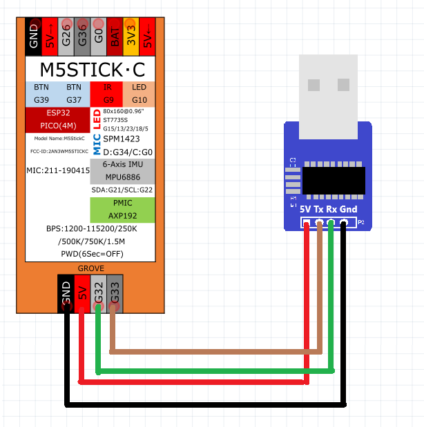
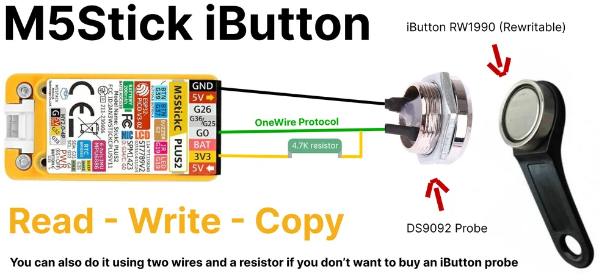

---
tags:
  - _TODO
todo: More documentation on BadUSB
      Needs updating when Matt (@emericklaw) publishes the BadUSB update
---
# Others

Features that do not fit in to other menus.

## QRCodes

Display QR codes for the Bruce AP, or any given string.

These can be added to [bruce.conf](../configuration/bruce.conf.md).

## Megladon

Become Bruce and eat all the fish in the ocean!

## Mic Spectrum

Shows the audio spectrum being picked up by the microphone in the device.

## Mic Record

Records audio from the devices microphone and saves as a `.wav` file.

## BadUSB

DuckyScript payloads are supported.

For more info on creating your own DuckyScripts [read here](https://docs.hak5.org/hak5-usb-rubber-ducky/ducky-script-basics/hello-world).

### Running BadUSB Scripts

* Create a payload and upload it to your device, you can use the [WebUI](../controlling-device/webui.md).
* Once uploaded choose the BadUSB menu item and browse to the file on your device.
* When connected to a device the playback of the script will start

#### Other Methods

1. Via the SDCard/LittleFS file manager in the "Others" menu (select a `.txt` file)
2. Remotely via the [WebUI](../controlling-device/webui.md#features) click on the :material-play: icon to start playback
3. Via a [serial cmd](../controlling-device/serial.md) e.g. `badusb run_from_file HelloWorld.txt`

### Using BadUSB on StickCs and Core/Core2 Devices

You will need to use a CH9329 module like as [this](https://pt.aliexpress.com/item/1005006680094576.html) or [this](https://pt.aliexpress.com/item/1005007031564072.html) to run the BadUSB on your device, wiring it into the Grove connector like this:

## USB Keyboard

Use your Bruce device as a USB keyboard when connected to another device.

## Clicker

USB Mouse clicker that you can control the delay between the clicks, this is usually used to cheat in some clicker games.

## iButton

Read, write and copy information from an iButton.

### Wiring

## Timer

Simple timer that you can set the hours, minutes and seconds until the countdown sound is played and the timer closes.
