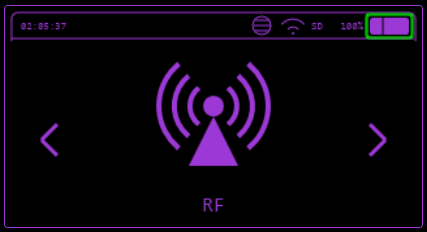
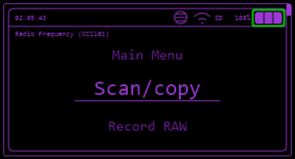
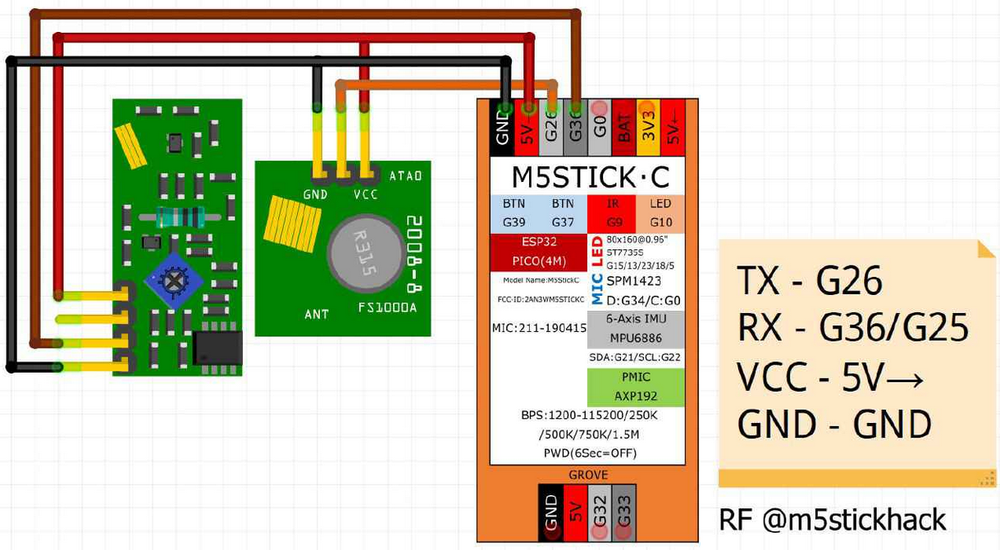

---
tags:
  - _TODO
todo: Check all menu features match documentation
---
# RF

Using a CC1101 module many RF features can be used like listening for RF signals, playing back saved signals and viewing the spectrum.

## Scan/Copy

Scan and copy RF signals in ASK/OOK modulation. It will start with the default frequency (433Mhz, common for M5 RF433R and FS1000A modules).

### Mode

* **Decode**: Tries to decode the signal with RCSwitch decoder.
* **RAW**: Will display RAW signals obtained from RCSwitch library.

### Filter

* **Code**: In Decode mode, it will only display decoded signals. More reliable in noisy environments.
* **All**: Capture Decoded and RAW signals.

### Replay

Send the last signal captured by Bruce.

### Save

Stores the signal into the `./BruceRF` folder as a `.sub` file on LittleFS or SD card (if available)

### CC1101 only menu

#### Range

Choose the frequency to scan or a range to detect the frequency.

#### Threshold

Choose the sensitivity of the scanner.

* -60 to a more strict error frequency (more precise)
* -80 to a more broad frequency (greater error, less precise)

## Record Raw

Records RAW signal using ESP32 RMT driver, displaying the raw signal obtained.

The recording will start once it detects a minimum signal on the input.

If using CC1101, you can choose the frequency you want to record.

In this function you can Save and replay signals.

## Custom SubGhz (limited compatibility)

Transmits signals stored in `.sub` files, they can be ones saved by Bruce in the BruceRF folder or others downloaded from internet.

## Spectrum

Displays waveform signals if RF frequencies are detected.

## RSSI Spectrum

Displays RSSI spectrum on a moving graph.

## SquareWave Spectrum

When signals are detected, it displays a squarewave based on the timings of the signal.

## Spectogram

Shows the waterfall spectogram for the specified frequency range.

## Listen

TODO

## Bruceforce

TODO

## Jammer Intermittent

Starts a PWM signal on the output, jamming the signal, not harming the transmitter, if listening to the frequency with a radio, you will be able to hear a "weeeoooooiiiiiioooooeeee" sound!

## Jammer Full

Starts a full square signal on the output, jamming the RF spectrum in the 433Mhz area, or in the **RF Frequecy** set in the Config Menu (if using CC1101).

## Config

### RF TX Pin and RF RX Pin

If using M5Stack, FS1000A or other single pin module to transmit the signal, here is where you can choose the pin.

### RF Module

#### M5 RF433T/R

M5 RF433T/R modules or unofficial modules.

#### CC1101

If you are using a StickCPlus (1.1 or 2), you will be presented to two options for CC1101.

##### CC1101 (legacy)

This setup is designed to use only the CC1101 in the bus, using [this setup](https://github.com/BruceDevices/firmware/blob/main/media/connections/cc1101_stick.jpg).

##### CC1101 (Shared SPI)

This setup is designed to share the SPI bus with the SD Card, but in this case you ned to add a transistor into the circuit, using [this setup](https://github.com/BruceDevices/firmware/blob/main/media/connections/cc1101_stick_SDCard.jpg).

## Supported Modules

### Official Modules

* **[M5Stack RF433R](https://docs.M5Stack.com/en/unit/rf433_r)** and **[RF433T](https://docs.M5Stack.com/en/unit/rf433_t)**
    * **Frequency**: Fixed at 433MHz
    * **Modulation**: Only ASK/OOK
    * **Connection**: Easier to connect

* **[CC1101 SPI Module](../external-modules/cc1101.md)**
    * **Frequency Range**: Supports multiple frequencies and modulations
    * **Connection**: More complicated, can be tested with exti/o2 from M5Stack

### Unofficial Modules

* **[FS1000A Transmitter + XY-MK-5V Receiver](https://components101.com/modules/433-mhz-rf-transmitter-module)**
    * **Frequency**: Fixed (usually 433MHz)
    * **Modulation**: Only ASK/OOK

!!! info

    The FS1000A and XY-MK-5V can be sold under various names

* **Other Single-Pinned Modules**
    * [Comparison of Cheap RF Modules](http://x311.blogspot.com/2017/10/comparison-of-cheap-rf-modules-with-ask.html)

!!! warning

    Some modules may have poor range; modifying the antenna can improve performance.

### Default Pins

* `Tx = GROVE_SDA`
* `Rx = GROVE_SCL`

## Unsupported/Not Working

* HC-11
* HC-12
* LoRa modules

## Replay Payloads Like Flipper

Bruce can now send raw formats similar to those supported in [this repository](https://github.com/Zero-Sploit/FlipperZero-Subghz-DB/tree/main/subghz).

## Methods to Transmit `.sub` Files

1. **Custom SubGhz App** in the **RF** menu
2. **SDCard/LittleFS File Manager** in the **Files** menu
3. **[WebUI](../controlling-device/webui.md#features)** by clicking the :material-play: icon
4. **Serial Command**: For example, use `subghz tx_from_file OpenGate.sub` for further details, refer to the [Serial Command Guide](../controlling-device/serial.md)
