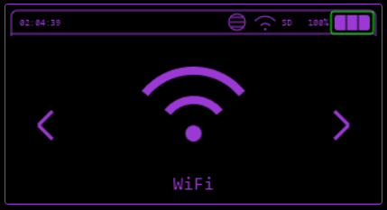
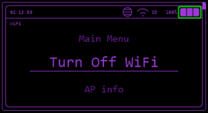

---
tags:
 -  _TODO
todo: Properly document each menu feature
---
# WiFi



Various WiFi functions including attacks, evil portal, telnet, SSH and Brudcegotchi.



## Connect WiFi

Connects into a chosen network, it will allow you to use **TCP Listener**, **ARP Poisoning**, **Station Deauth**, **TelNet**, **SSH** and **Scan Hosts** functions.


## WiFi AP

Launches an Access point, so you can connect up to 4 guests to share information between each other.


## WiFi Atks

### Target Atks

Scans for a WiFi AP to either:

* Get more information of it (MAC and channel),
* Send Deauth frames
* Clone AP name and make a Evil Portal
* Deauth + Clone
* Deauth + Clone and verify, in case you are trying to get password of a WiFi network.


### Beacon Spam

Spams SSID frames in the air.

#### Funny SSID

Spams a list of funny hardcoded SSID names.


#### Rick Roll

Spams Rick Roll lyrics in SSID names.


#### Random SSID

Spams random SSIDs, composed by random numbers and letters.


#### Custom SSID

Spams a list of SSIDs writen in a **.txt** file.

There must be:

* One SSID per line
* Up to 32 characters per SSID
* as many SSID you want

```txt
My SSID
Your SSID
His SSID
etc...
```


### Deauth Flood

Foods Deauth packets to all Access Points it can find.


## Evil Portal

In Evil Portal mode, Bruce creates a open WiFi, with DNS, DHCP and web server for captive portal.

* Evil Portal serves a fake login page that claims to provide internet access if you log in.
* This is a social engineering attack, and will log the username and passwords entered on the page.
* You can type the SSID before and change the current SSID by connecting to the portal from your own device and browsing to [http://172.0.0.1/creds](http://172.0.0.1/creds) or [http://172.0.0.1/ssid](http://172.0.0.1/ssid)
* If your device has an SD Card the usernames and passwords will be logged to Bruce_creds.csv on the SD Card for you to view.

### Example Portals

For examples of portals you can check [here](https://github.com/BruceDevices/firmware/tree/main/sd_files)

### Setting AP Name from HTML

#### Overview

The `EvilPortal` system supports the ability to define an Access Point (AP) name directly within your HTML files.

By including a specific tag in the first line of your HTML file, Bruce will automatically extract and set the AP name, streamlining the setup process.


#### How It Works

1. Add the following tag in the **first line** of your HTML file `<!-- AP="YourCustomAPName" -->`
    * Replace `YourCustomAPName` with the desired name for your Access Point
2. When the HTML file is loaded, the system will
    * Parse the first line of the file.
    * Detect the `AP="..."` tag.
    * Extract the value and set it as the AP name
3. If the tag is not present it will ask you for AP name


#### Example HTML File

```html
<!-- AP="MyCoolNetwork" -->
<!DOCTYPE html>
<html>
<head>
    <title>EvilPortal</title>
</head>
<body>
    <h1>Welcome to EvilPortal!</h1>
</body>
</html>
```

> In this example, the AP name will automatically be set to **MyCoolNetwork**.


#### Benefits

* **Dynamic Configuration** Easily customize AP names without modifying code
* **Ease of Use** Set up AP names directly in your HTML files for faster deployment


#### Notes

* Ensure the `<!-- AP="..." -->` tag is in the **very first line** of the file.
* The feature does not affect the functionality of other HTML content


## Listen TCP

Listen for incoming TCP connections on a specified port.

It waits for client connections, allowing the device to act as a server and handle communication with connected clients.


## Client TCP

The ESP32 can connect to a remote server as a client over TCP.

You can configure the target server's IP address and port, enabling data transmission to and from the server.


## TelNet

Connect to TelNet servers and execute remote commands.


## SSH

Connect to SSH servers and execute remote commands.


## DPWO-ESP32

Searches for default credentials for some router operators [more info here](https://github.com/caioluders/DPWO)


## RAW Sniffer

Saves `.pcap` to SD card with raw monitoring, you can also select for it to save only EAPOL/HandShakes and stop spamming deauth packets to detected beacons previously detected.


## Scan Hosts

Does a ARP scan on current network based on the mask (equivalent to arp -a), after that it will list every host online, then you can select some host to have a TCP port scan on selected ports (20, 21, 22, 23, 25, 80, 137, 139, 443, 3389, 8080, 8443, 9090 and more), as seen in "ports" variable on scan_hosts.cpp and let you choose a target host attack such as:


## Host Info

Discover open ports (20, 21, 22, 23, 25, 80, 137, 139, 443, 3389, 8080, 8443, 9090 and more) on the Host.


### SSH Connect

Tries to connect into the Host using SSH.


### Station Deauth

Spams deauth frames targetted to this particular device.


### ARP Spoofing

Sends fake ARP Resonses to the host and to the Gateway, provoking communication interruption.

This is the fist step of a Man-In-The-Middle attack using the 2nd OSI layer vulnerability.


### ARP Poisoning

Sends fake ARP responses to all hosts and to the gateway with random MAC addresses. It can possibly cause CAOS in the network, as all devices won't find the gateway to communicate.


## WireGuard Tunneling

To be able to connect to a WireGuard tunnel with your cardputer easily, you need to have your WireGuard `.conf` file and place on the SD card root directory called `wg.conf`.

If you don't know how to generate a `.conf` file for WireGuard [read here](https://www.wireguard.com/quickstart/).


## Brucegotchi

This feature does a lot of things at the same time, such as:

* Pwngrid spam
* Deauth nearby WiFi networks in different channels
* Collect and save HandShakes (EAPOL)


## Responder

[Responder](https://github.com/lgandx/Responder) is a well known tool for exploiting infrastructures, one of the things it does is LLMNR Poisoning, which is what this function in Bruce does (thanks to [7h30th3r0n3](https://github.com/7h30th3r0n3)).


## Config

### Add Evil WiFi

Adds an SSID into the list so you can choose it with ease when opening an Evil Portal.


### Remove Evil WiFi

Deletes a previously added SSID.
