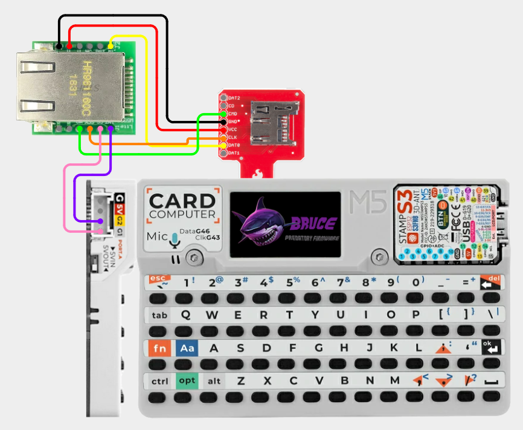

# Cardputer - W5500 Ethernet

## Items Needed

* [W5500 Ethernet Module](../../external-modules/w5500-ethernet-module.md#modules)
* [Micro SD Sniffer](../../external-modules/micro-sd-sniffer.md#modules)
  
## W5500

### Pins

| W5500 | Cardputer |
| -: | - |
| GND - 1 | GND (on SD Sniffer) |
| SCLK - 2 | CLK (on SD Sniffer) |
| INT - 3 | G2 |
| SCS - 4 | G1 |
| RST - 5 | Not Connected |
| MOSI - 6 | CMD (on SD Sniffer) |
| GND - 7 | Not Connected |
| MISO - 8 | DAT0 (on SD Sniffer) |
| 5V - 9 | Not Connected |
| 3V3 - 10 | VCC (on SD Sniffer) |

### Wiring Diagram

[View on Cirkit Designer](https://app.cirkitdesigner.com/project/cfcc4583-0a38-4e50-89f5-382d6c98d5a1){target="_blank" rel="noopener"}

{ width="400" }

## W5500 - Mini

### Pins

| W5500 | Cardputer |
| -: | - |
| GND - 1 | GND (on SD Sniffer) |
| 3V3 - 2 | VCC (on SD Sniffer) |
| 3V3 - 3 | Not Connected |
| NC - 4 | Not Connected |
| RST - 5 | Not Connected |
| MISO - 6 | DAT0 (on SD Sniffer) |
| INT - 7 | G2 |
| CS - 8 | G1 |
| SCLK - 9 | CLK (on SD Sniffer) |
| MOSI - 10 | CMD (on SD Sniffer) |
| GND - 11 | GND |
| GND - 12 | GND |

### Wiring Diagram

[View on Cirkit Designer](https://app.cirkitdesigner.com/project/ebba9efb-6853-498e-bc0e-303833679a1b){target="_blank" rel="noopener"}

{ width="400" }
